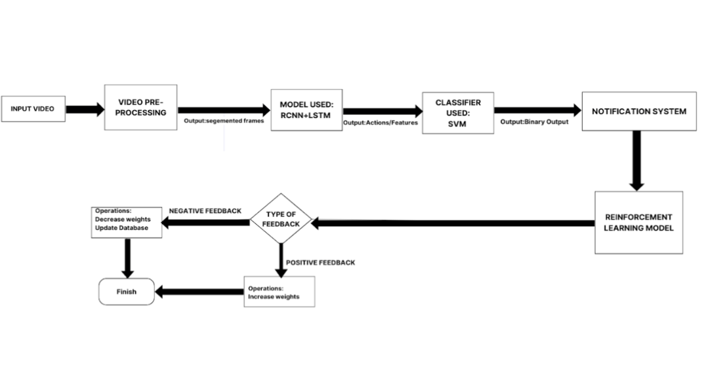

# Suspicious-Activity-Detector
The project pursues the development of Real-time Video Analysis-based Suspicious Activity Detector, which will utilize modern object detection algorithms in detecting anticipated shoplifting incidences and other activities that trespass the stores, with no assistance from the human operatives.

## **Approach**

## **Technologies Used**
1. YOLO (You Only Look Once): Utilized for real-time object detection, this deep learning model identifies and tracks objects in the video feed, drawing bounding boxes around detected entities such as individuals, bags, or merchandise.

2. TensorFlow: Facilitates video preprocessing and the development of machine learning pipelines, enabling seamless integration of object detection and behavioral analysis.

3. Pose Detection: Marks key body coordinates and identifies motion patterns, aiding in behavioral analysis to determine if movements align with suspicious activities.

5. Scikit-learn: Facilitates preprocessing and feature extraction from video data, supporting the classification and anomaly detection processes.

6. Convolutional Neural Networks (CNNs): Analyzes image and video frames for extracting spatial features, forming the backbone of object detection and pattern recognition tasks.
   
7. Pretrained EfficientNet Model: Utilized to extract robust features from video frames, this model accelerates development by leveraging transfer learning and fine-tuning for domain-specific tasks.

8. LSTM (Long Short-Term Memory Networks): Processes temporal information from video frames, analyzing sequences of actions to detect patterns indicative of suspicious behavior.
   
9. Reinforcement Learning with Human Feedback (RLHF): Enhances the system's ability to refine and improve its decision-making by incorporating feedback from store personnel on flagged incidents, ensuring the model learns from real-world     
   scenarios and reduces false positives over time.
   
10. User Interface (UI): Combines a Python-based backend server and a frontend dashboard built using HTML and CSS. The UI processes video feeds, applies ML model inference, and displays annotated videos with bounding boxes and real-time 
   behavioral labels. It also delivers alerts to store personnel and provides actionable insights via an intuitive dashboard.
